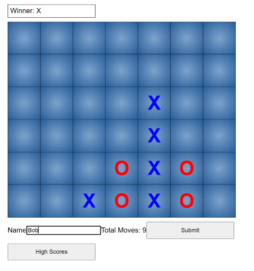
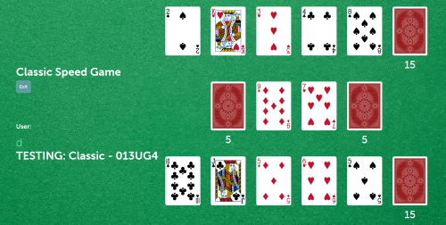

## Tyler Godfrey
### About
- 🔭 I’m currently working on multiplayer web game
- 🌱 I’m currently learning full stack development using MERN
- 📫 How to reach me: supperd6@gmail.com
- ⚡ Fun fact: I love boating and outdoors activities

### Languages and tools
- react
- Javascript 
- C#, C++
- html5, CSS
- MERN

## Recent Projects
### Connect 4
  
Classic Connect 4 with a high scores page that connects to a database.  
[Game Code](https://github.com/TylerGodfrey106e/Connect4)  
### Speed Card Game
  
A multiplayer cardgame with login authentication, chat and rooms.  
[Game Code](https://github.com/TylerGodfrey106e/Redacted-Speed-Game)  
